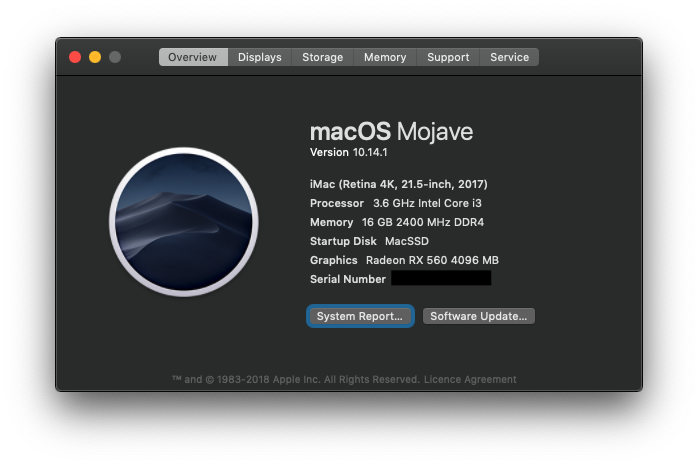

Hackintosh Mojave Installation Guide for Gigabyte B360M D3H Hackintosh & Clover EFI Folder 

### My System Hardware

- CPU: Intel i3 8100 
- Motherboard: Gigabyte B360M-D3H 
- Memory: G.Skill DDR4 8GB x 2 
- GPU: Sapphire Radeon RX 560 4GB

### What's Working?
Everything.
100% Stable

##### Working
- Sleep/Wake 
- Ethernet
- Audio (including digital audio) [native applALC audio]
- iGPU + RX 560 GPU
- All USB ports (including USB 3)
- App Store

### Install Guide

### VERY IMPORTANT NOTE: 
if you USB ports do not work after using my clover folder then open the config.plist file with clover configurator and remove this **(uia_exclude=HS02;HS03;HS09;HS10;HS12;HS13;HS14;HS15;SS02;SS03)**  string from boot argus.

I made the installer on Windows using Olarila Mojave image & used [Etcher.app](https://www.balena.io/etcher/)
Download Olarila Image From the Forum with [Installation Guide](http://olarila.com/forum/viewtopic.php?f=51&t=6743):
Or You can Use a Vanilla Guide but Olarila is faster but both are Vanilla. (olarila is highly recommended) 

### Bios Settings: 
	•	Load optimised default 
	•	Disable CSM 
	•	Disable Fast 
	•	Enable Internal Graphics & VT-D 
	•	Disable only serial port (first option) 

After Installing MacOS on your system copy my clover folder to your EFI Partition and Open the config.plist make sure you set the following:
- SerialNumber
- BoardSerialNumber
- SmUUID

**Also Depending on your CPU Choose the Right SMBIOS.**

### Post Installation
Fix USB 3 Ports
[How to Stay within 15 ports limit using UsbInjectall and Clover boot argument](https://olarila.com/forum/viewtopic.php?f=79&t=7370&fbclid=IwAR0aba59fTABiOx2hLesroLLHOTl8rAQQwQ-d0bpPm4LZ3UNovBrGdjyEb8)

<strike>Sound</strike> (ALC892)
_Sound should be working obb if you use my clover folder._

### Screenshots

